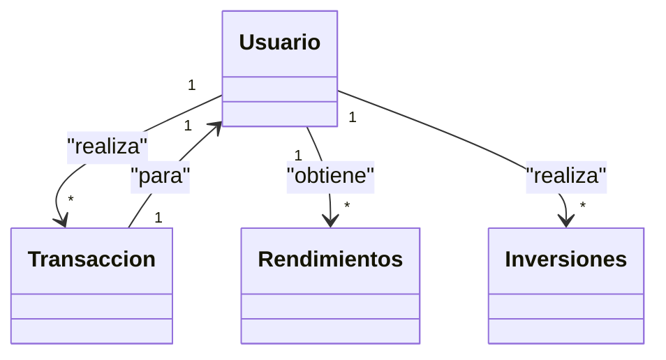
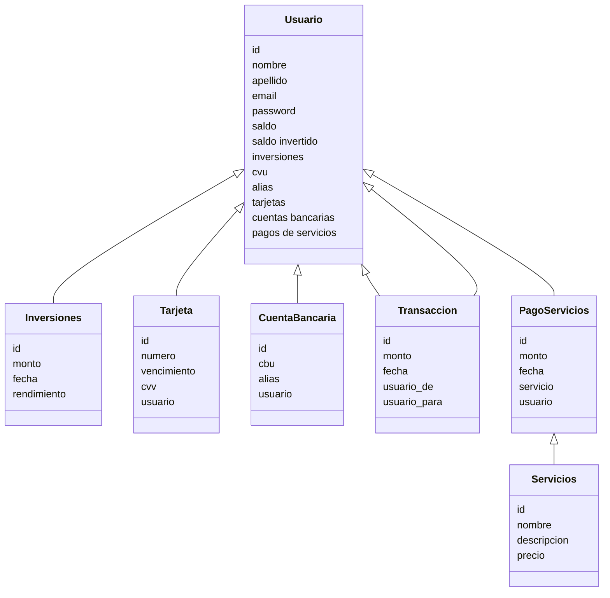
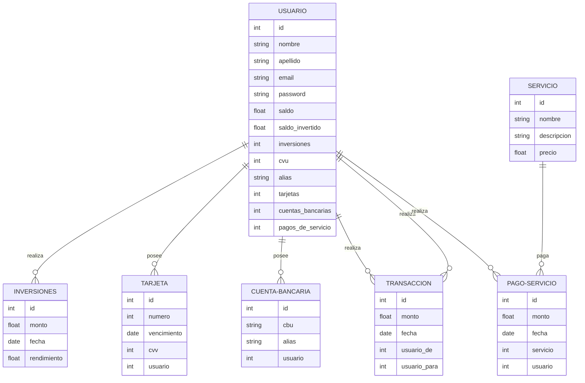

En este trabajo práctico grupal diseñaremos la base de datos a ser utilizada
para resolver un problema de un dominio específico. El trabajo deberá ser
realizado en grupos de entre 2 y 3 estudiantes.

El trabajo práctico está dividido en dos entregas, con duración de un mes
cada una. La primera entrega evalúa el diseño de la base de datos y el uso
conceptual de la misma, mientras que la segunda entrega se enfocará en
poder armar una arquitectura y un flujo de datos que habiliten a una
organización a utilizarla.

Primera entrega: diseño de la base de datos

Esta entrega se enfoca en desarrollar todos los tópicos que trabajamos en la
primera mitad de la materia: tomar un dominio, hacer un modelado
conceptual, pasarlo al modelo relacional, implementarlo en Postgres y poder
hacer consultas que sean de interés sobre el conjunto de datos.

El dominio sobre el cual trabajará la base de datos queda a libre elección por
cada equipo de trabajo.

La fecha de entrega del trabajo práctico será en la semana 9 del semestre.

Los entregables para esta etapa son:

- Un documento con el detalle del dominio, todos los puntos del diseño,
y el sustento lógico para las decisiones tomadas.
- Los archivos SQL usados para construir las tablas.
- Los archivos SQL con las consultas diseñadas.

1. Escoger un dominio. En este paso deberán escoger un dominio con el que
les interese trabajar (por ej., podría tratarse de una App del estilo de Spotify,
Youtube), o bien determinado tipo de empresa, ONG, organización sin fines
de lucro. Junto con la elección del dominio, deberán decidir cuál será el
alcance del modelo (por ejemplo, en el caso de una App como Spotify, ¿el
objetivo sería modelar toda la actividad del usuario? ¿modelar también la
facturación y pagos? ¿o ambas cosas? ¿Queremos también tener la
posibilidad de analizar los datos para tomar decisiones?

El output de este paso deberá ser un análisis de requerimientos de la base
de datos.

2. Modelado conceptual. Modelar las entidades e interrelaciones presentes en
el dominio. Construir un modelo entidad-interrelación del mismo.

3. Modelado lógico. Realizar el pasaje del modelo entidad-interrelación al
modelo relacional. El output será un modelo de tablas de la base de datos.
Se espera que las relaciones construidas estén en BCNF

Dominio - MercadoPago

Modelo conceptual

- Usuario
- Transaccion
- Inversiones
- Servicios
- PagoServicios
- Tarjeta
- CuentaBancaria

Usuario
- id
- nombre
- apellido
- email
- password
- saldo (pesos)
- saldo invertido (pesos)
- inversiones (pesos) (1 a muchos)
- cvu
- alias
- tarjetas (1 a muchos)
- cuentas bancarias (1 a muchos)
- pagos de servicios (1 a muchos)

Transaccion
- id
- monto
- fecha
- usuario_de (1 a 1)
- usuario_para (1 a 1)

Inversiones
- id
- monto
- fecha
- rendimiento

Servicios
- id
- nombre
- descripcion
- precio

PagoServicios
- id
- monto
- fecha
- servicio
- usuario

Tarjeta
- id
- numero
- vencimiento
- cvv
- usuario

CuentaBancaria
- id
- cbu
- alias
- usuario

## Object diagram - MercadoPago

## Opción 1

## Opción 2

## erDiagram - MercadoPago

## SQL - MercadoPago
