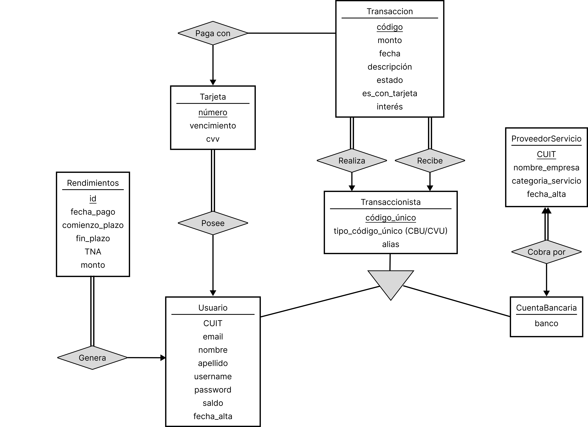
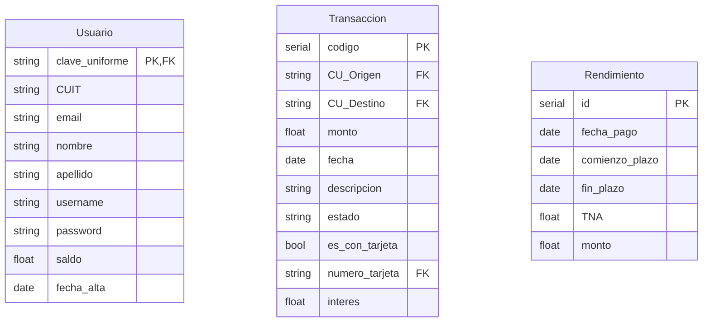
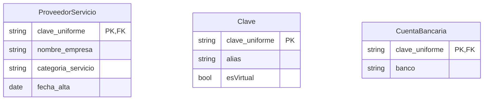
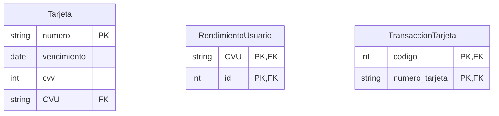

<!-- markdownlint-disable MD033 MD046 -->

## Dominio - Mercado Pago

Para comenzar, vamos a definir el dominio que vamos a modelar, que es la aplicación de Mercado Pago. Queremos enfocarnos en varios aspectos de la aplicación: los usuarios que realizan transacciones entre ellos, transacciones a/desde cuentas bancarias externas, pago de servicios e inversiones con rendimiento diario. A continuación realizamos una descripción mas detallada del alcance y requerimientos del modelo.

### Análisis de Requerimientos de la Base de Datos

#### Usuarios:

-   La base de datos debe permitir el registro y almacenamiento de usuarios de la aplicación de Mercado Pago.
-   Se requiere almacenar información personal de los usuarios, como nombre, dirección, correo electrónico, número de teléfono y DNI.

#### Transacciones entre Usuarios:

-   Los usuarios deben poder realizar transacciones entre ellos dentro de la aplicación. 
-   Cada transacción debe registrar el monto, la fecha, la descripción y su estado (pendiente, fallida, completada).
- Las transacciones pueden ser realizadas con saldo en cuenta o con tarjetas de crédito/débito. En caso de que se realice con tarjeta de crédito, la transacción tiene un costo extra de interés.

#### Transacciones a/desde Cuentas Bancarias Externas:

-  Los usuarios deben poder realizar transacciones de dinero desde sus cuentas de Mercado Pago a Cuentas Bancarias Externas. Estas transacciones pueden ser realizadas con saldo en cuenta o con tarjetas de crédito/débito.
-  Los usuarios deben poder recibir transferencias desde Cuentas Bancarias Externas a sus cuentas de Mercado Pago.
-   Cada transacción debe registrar el monto, la fecha, la cuenta bancaria de destino/origen y su estado.

#### Pago de Servicios:

-   Los usuarios deben poder utilizar la aplicación para pagar servicios, como facturas de servicios públicos, recargas de celular, etc.
- Las empresas que deseen cobrar sus servicios por Mercado Pago deben registrarse dentro de la aplicación como proveedor de servicio. Por simplificación, asumimos que las empresas brindan una Cuenta Bancaria Externa para realizar los cobros.
-   Se necesita almacenar información sobre los servicios pagados, como el proveedor de servicio, el monto, la fecha y el destinatario del pago.

#### Inversiones y rendimientos:

-   Los usuarios deben poder invertir dinero y obtener rendimientos diarios a través de la aplicación.
-   Se necesita almacenar información sobre las inversiones, como el monto invertido, la tasa de interés, la fecha de inicio y vencimiento, etc.

Con esta información, podemos pasar al modelado conceptual.

## Modelo Entidad-Interrelación
Los tipos de entidades de nuestro modelo son:
- Transacción
- Rendimiento
- Tarjeta
- Transaccionista
    - CuentaBancaria (especialización)
    - Usuario (especialización)
- ProveedorServicio

A continuación presentamos un diagrama ER con los tipos de interrelaciones y tipos de entidades de nuestro modelo.

<!-- Usuarios generan rendimientos
Usuarios poseen tarjetas
Usuario Realiza Transaccion
Usuario Recibe Transaccion
Transacciones Pagan con Tarjeta
CuentaBancaria Realiza Transaccion
CuentaBancaria Recibe Transaccion
CuentaBancaria Cobra Por ProveedorServicio -->

## Modelo Relacional

A continuación presentamos nuestro pasaje a modelo relacional 

<Relations>

<r>Clave</r>(<pk>clave_uniforme</pk>, alias, esVirtual)
<r>Usuario</r>(<pk><fk>clave_uniforme</fk></pk>, CUIT, email, nombre, apellido, username, password, saldo, fecha_alta)
<r>CuentaBancaria</r>(<pk><fk>clave_uniforme</fk></pk>, banco)
<r>ProveedorServicio</r>(<pk><fk>clave_uniforme</fk></pk>, nombre_empresa, categoria_servicio, fecha_alta)
<r>Transaccion</r>(<pk>codigo</pk>, <fk>CU_Origen</fk>, <fk>CU_Destino</fk>, monto, fecha, descripcion, estado, es_con_tarjeta, <fk>numero_tarjeta</fk>, interes)
<r>Rendimiento</r>(<pk>id</pk>, fecha_pago, comienzo_plazo, fin_plazo, TNA, monto)
<r>Tarjeta</r>(<pk>numero</pk>, vencimiento, cvv, <fk>CVU</fk>)

<r>RendimientoUsuario</r>(<pk><fk>CVU</fk>, <fk>id</fk></pk>)
<r>TransaccionTarjeta</r>(<pk><fk>codigo</fk>, <fk>numero_tarjeta</fk></pk>)

</Relations>

En las siguientes tablas presentamos los dominios de cada atributo

