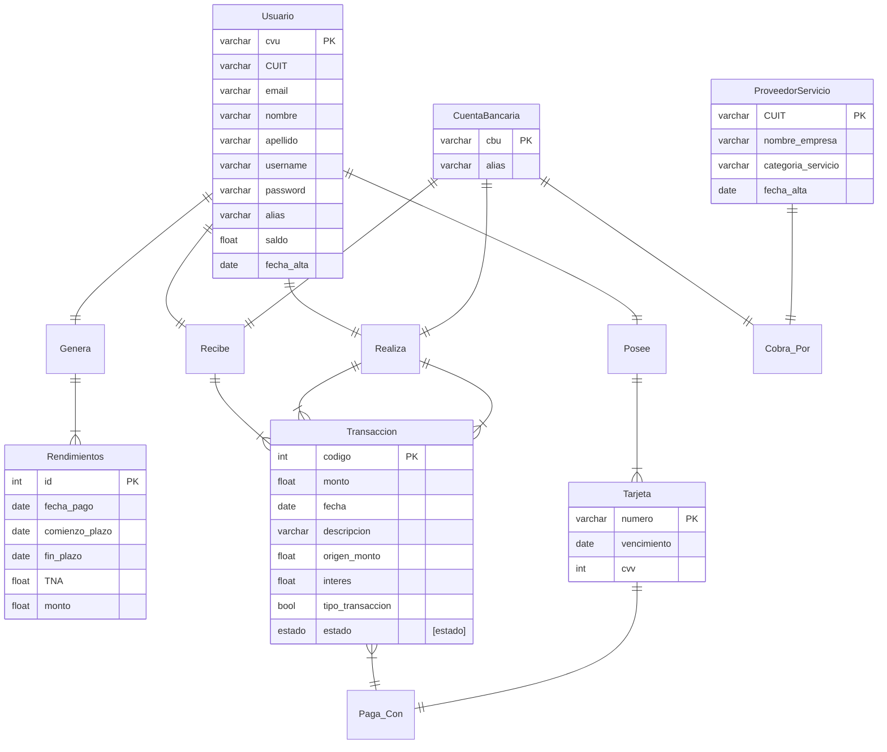

<!-- markdownlint-disable MD033 MD046 -->

# Consigna
En este trabajo práctico grupal diseñaremos la base de datos a ser utilizada
para resolver un problema de un dominio específico. El trabajo deberá ser
realizado en grupos de entre 2 y 3 estudiantes.

El trabajo práctico está dividido en dos entregas, con duración de un mes
cada una. La primera entrega evalúa el diseño de la base de datos y el uso
conceptual de la misma, mientras que la segunda entrega se enfocará en
poder armar una arquitectura y un flujo de datos que habiliten a una
organización a utilizarla.

## Primera entrega: diseño de la base de datos

Esta entrega se enfoca en desarrollar todos los tópicos que trabajamos en la
primera mitad de la materia: tomar un dominio, hacer un modelado
conceptual, pasarlo al modelo relacional, implementarlo en Postgres y poder
hacer consultas que sean de interés sobre el conjunto de datos.

El dominio sobre el cual trabajará la base de datos queda a libre elección por
cada equipo de trabajo.

La fecha de entrega del trabajo práctico será en la semana 9 del semestre.

Los entregables para esta etapa son:

- Un documento con el detalle del dominio, todos los puntos del diseño,
y el sustento lógico para las decisiones tomadas.
- Los archivos SQL usados para construir las tablas.
- Los archivos SQL con las consultas diseñadas.

1. Escoger un dominio. En este paso deberán escoger un dominio con el que
les interese trabajar (por ej., podría tratarse de una App del estilo de Spotify,
Youtube), o bien determinado tipo de empresa, ONG, organización sin fines
de lucro. Junto con la elección del dominio, deberán decidir cuál será el
alcance del modelo (por ejemplo, en el caso de una App como Spotify, ¿el
objetivo sería modelar toda la actividad del usuario? ¿modelar también la
facturación y pagos? ¿o ambas cosas? ¿Queremos también tener la
posibilidad de analizar los datos para tomar decisiones?
El output de este paso deberá ser un análisis de requerimientos de la base
de datos.

2. Modelado conceptual. Modelar las entidades e interrelaciones presentes en
el dominio. Construir un modelo entidad-interrelación del mismo.

3. Modelado lógico. Realizar el pasaje del modelo entidad-interrelación al
modelo relacional. El output será un modelo de tablas de la base de datos.
Se espera que las relaciones construidas estén en BCNF
4. Modelado físico. Definir las tablas en la base de datos. El output será un script SQL que automatice la construcción de todas las tablas junto con sus restricciones, y la eventual definición de usuarios y permisos. 
5. Consulta. Diseñar al menos 10 consultas que sirvan para describir los datos. Las consultas deben incluir: ○ Juntas (JOIN) ○ Agrupamiento (GROUP BY) ○ Funciones de ventana (window functions)

# Resolución
## Dominio - Mercado Pago

Para comenzar, vamos a definir el dominio que vamos a modelar, que es la aplicación de Mercado Pago. Queremos enfocarnos en varios aspectos de la aplicación: los usuarios que realizan transacciones entre ellos, transacciones a/desde cuentas bancarias externas, pago de servicios e inversiones con rendimiento diario. A continuación realizamos una descripción mas detallada del alcance y requerimientos del modelo.

### Análisis de Requerimientos de la Base de Datos

#### Usuarios:

-   La base de datos debe permitir el registro y almacenamiento de usuarios de la aplicación de Mercado Pago.
-   Se requiere almacenar información personal de los usuarios, como nombre, dirección, correo electrónico, número de teléfono y DNI.

#### Transacciones entre Usuarios:

-   Los usuarios deben poder realizar transacciones entre ellos dentro de la aplicación. A este tipo de transacción la denominamos **Transacción Interna**.
-   Cada transacción debe registrar el monto, la fecha, la descripción y su estado (pendiente, fallida, completada).
- Las transacciones pueden ser realizadas con saldo en cuenta o con tarjetas de crédito/débito. En caso de que se realice con tarjeta de crédito, la transacción tiene un costo extra de interés.

#### Transacciones a/desde Cuentas Bancarias Externas:

-  Los usuarios deben poder realizar transacciones de dinero desde sus cuentas de Mercado Pago a Cuentas Bancarias Externas. Estas transacciones pueden ser realizadas con saldo en cuenta o con tarjetas de crédito/débito.
-  Los usuarios deben poder recibir transferencias desde Cuentas Bancarias Externas a sus cuentas de Mercado Pago.
-   Cada transacción debe registrar el monto, la fecha, la cuenta bancaria de destino/origen y su estado. A este tipo de transacción la denominamos **Transacción Externa**.

#### Pago de Servicios:

-   Los usuarios deben poder utilizar la aplicación para pagar servicios, como facturas de servicios públicos, recargas de celular, etc.
- Las empresas que deseen cobrar sus servicios por Mercado Pago deben registrarse dentro de la aplicación como proveedor de servicio. Por simplificación, asumimos que las empresas brindan una Cuenta Bancaria Externa para realizar los cobros, por lo que un pago de servicio es una **Transacción Externa**.
-   Se necesita almacenar información sobre los servicios pagados, como el proveedor de servicio, el monto, la fecha y el destinatario del pago.

#### Inversiones y rendimientos:

-   Los usuarios deben poder invertir dinero y obtener rendimientos diarios a través de la aplicación.
-   Se necesita almacenar información sobre las inversiones, como el monto invertido, la tasa de interés, la fecha de inicio y vencimiento, etc.

Con esta información, podemos pasar al modelado conceptual.

## Modelo conceptual
Los principales tipos de entidades de nuestro modelo son:
- Usuario
- Transacción
- Inversion
- Tarjeta
- CuentaBancaria
- ProveedorServicio

## Modelo Entidad-Interrelación

<!-- Usuarios generan rendimientos
Usuarios poseen tarjetas
Usuario Realiza Transaccion
Usuario Recibe Transaccion
Transacciones Pagan con Tarjeta
CuentaBancaria Realiza Transaccion
CuentaBancaria Recibe Transaccion
CuentaBancaria Cobra Por ProveedorServicio -->

## Modelo Relacional

<Relations>

<r>Usuario</r>(<pk>CVU</pk>, CUIT, email, nombre, apellido, username, password, alias, saldo, fecha_alta)
<r>CuentaBancaria</r>(<pk>CBU</pk>, alias, banco)
<r>Transaccion</r>(<pk>codigo</pk>, <fk>CU_Origen</fk>, <fk>CU_Destino</fk>, tipo_origen, tipo_destino, monto, fecha, descripcion, estado, es_con_tarjeta, <fk>numero</fk>, interes)
<r>Rendimiento</r>(<pk>id</pk>, fecha_pago, comienzo_plazo, fin_plazo, TNA, monto)
<r>ProveedorServicio</r>(<pk>CUIT</pk>, <fk>CBU</fk>, nombre_empresa, categoria_servicio, fecha_alta, alias)
<r>Tarjeta</r>(<pk>numero</pk>, vencimiento, cvv, <fk>CVU</fk>)

<!-- Tablas Intermedias: -->

<r>RendimientoUsuario</r>(<pk><fk>CVU</fk>, <fk>id</fk></pk>)
<r>TransaccionTarjeta</r>(<pk><fk>codigo</fk>, <fk>numero</fk></pk>)

</Relations>

## Normalización

Para normalizar nuestro modelo, vamos a analizar las dependencias funcionales de cada tabla.

### Usuario

    CVU -> CUIT, email, nombre, apellido, username, password, alias, saldo, fecha_alta
    alias -> CVU, CUIT, email, nombre, apellido, username, password, saldo, fecha_alta

### CuentaBancaria

    CBU -> alias, banco
    alias -> CBU, banco

### Transaccion

    codigo -> CU_Origen, CU_Destino, tipo_origen, tipo_destino, monto, fecha, descripcion, estado, es_con_tarjeta, numero, interes

### Rendimiento

    id -> fecha_pago, comienzo_plazo, fin_plazo, TNA, monto

### ProveedorServicio

    CBU -> CUIT, nombre_empresa, categoria_servicio, fecha_alta
    alias -> CBU, CUIT, nombre_empresa, categoria_servicio, fecha_alta

### Tarjeta

    numero -> vencimiento, cvv, CVU

### RendimientoUsuario

    CVU, id -> CVU, id

### TransaccionTarjeta

    codigo, numero -> codigo, numero

### Normalización

Tenemos dependencias funcionales parciales en las tablas Usuario, CuentaBancaria, ProveedorServicio y Tarjeta ya que todos los atributes o dependen de la clave primaria o de un atributo que no es clave primaria (alias).

Para resolver la normalización, decidimos crear una tabla para las Claves Uniformes, que se utilizan como clave primaria en las tablas de Usuario, CuentaBancaria, ProveedorServicio y Tarjeta. Esta tabla nos indica tambien un alias para cada Clave Uniforme, y si la Clave Uniforme es del tipo CVU (Clave Virtual Uniforme) o CBU (Clave Bancaria Uniforme). Ademas de esta forma la Transaccion puede referenciar a la Clave Uniforme de origen y destino sin tener que repetir los tipos de Clave Uniforme de origen y destino.

<Relations>

<r>Clave</r>(<pk>clave_uniforme, alias</pk> esVirtual)

<r>Usuarios</r>(<pk><fk>clave_uniforme</fk><pk>, CUIT, email, nombre, apellido, username, password, saldo, fecha_alta)

<r>CuentaBancaria</r>(<pk><fk>clave_uniforme</fk><pk>, banco)

<r>ProveedorServicio</r>(<pk><fk>clave_uniforme</fk><pk>, nombre_empresa, categoria_servicio, fecha_alta)

<r>Transaccion</r>(<pk>codigo</pk>, <fk>CU_Origen</fk>, <fk>CU_Destino</fk>, monto, fecha, descripcion, estado, es_con_tarjeta, <fk>numero</fk>, interes)

</Relations>

## Modelo Físico
<!-- Read and display modelo.sql -->

## Consultas

1. Listar los usuarios que realizaron transacciones con tarjeta de crédito.

    1. Listar los montos transaccionados con tarjetas de crédito.

2. Listar las transacciones realizadas por un usuario en particular.

    2. Listar las transacciones realizadas por un usuario en particular en un periodo de tiempo

3. Obtener los rendimientos en un periodo de tiempo para todos los usuarios.

4. Cantidad de transacciones rechazadas y la suma de los montos de las mismas para todos los usuarios y para un usuario en particular.

5. El pago de servicios con mas pagos recibidos en el último mes.

6. (Para hacer con window functions) Calcular los rendimientos relativos al periodo anterior para cada usuario.

7. Ranking de usuarios con mayor monto transaccionado en el último mes.

8. Ranking de usuarios por rendimientos obtenidos.

9. (Para hacer con window functions)

10. Calcular los intereses ganados en transacciones pagados con tarjetas en el último més.
